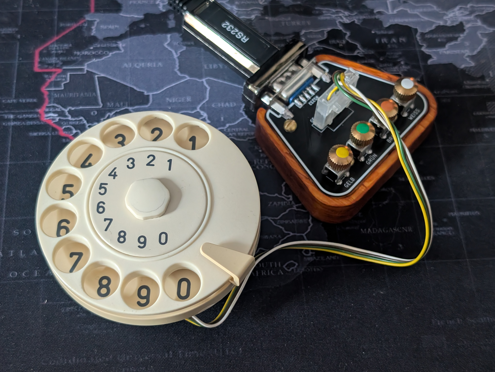
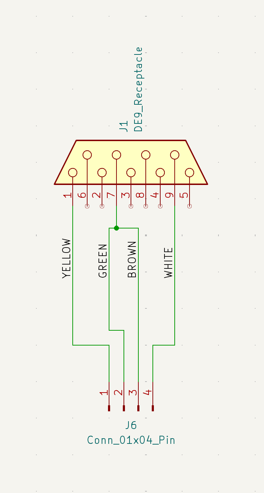
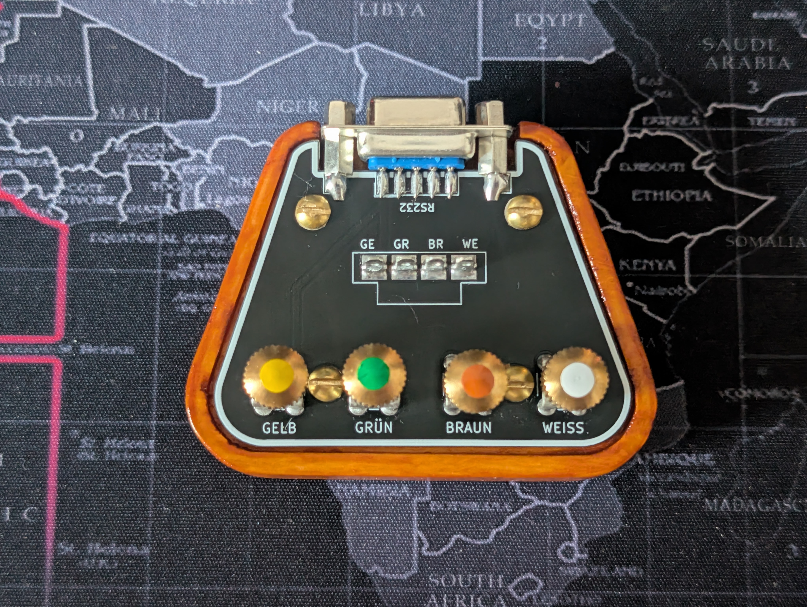
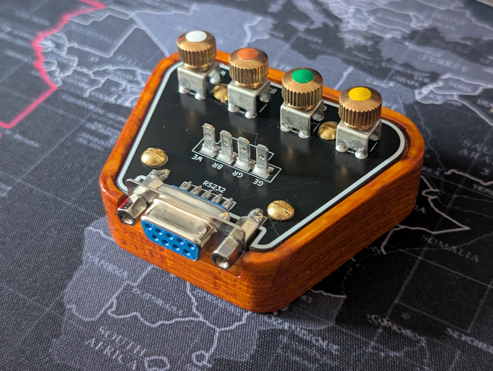

# Rotary Dial Tester Adapter

A small connector/adapter for testing vintage rotary dials (e.g., W48/W49) on a computer. It connects via DB9 RS232 (use an RS232-to-USB adapter) and provides both color-coded screw terminals (GE/GR/BR/WE) and a 4-pin connector for the dial wiring.

## Overview
- DB9 RS232 interface for USB serial adapters
- Color-coded screw terminals (GE/GR/BR/WE)
- 4-pin connector for a cable harness
- Tested and working with: DIGITUS USB auf Seriell Adapter - RS232 Konverter - USB 2.0 Typ-C zu DSUB 9M - FTDI FT232RL Chipsatz - 1 m Anschlusskabel (https://www.amazon.de/dp/B07917RBBJ)

## Wiring
Use either the screw terminals or the 4-pin connector. The wiring diagram below shows the pin mapping.

## Web-based Rotary Dial Tester
Project: https://github.com/SunboX/Rotary-Dial-Tester (live: https://rotary-dial-tester.com/)

- Web app using the Web Serial API to read rotary dial pulses.
- Requirements: Chromium-based browser, served over `https://` or `http://localhost`, and a serial adapter that exposes modem status lines (DCD/DSR/RI).
- Signal mapping: nsi = DCD, nsr = DSR, nsa = RI; RTS is set high on connect.
- Usage: Connect COM, Start Test, then dial digits 2-0 (1 is too short for frequency measurement). The browser prompts for the port (no auto-detect).
- Debounce (EP): adds a wait time between DCD reads; higher values can reduce bounce but may affect measurements.
- Analysis: after 10 measurements of the same digit, the app shows runtime spread and pulse/pause tables.

## Photos

